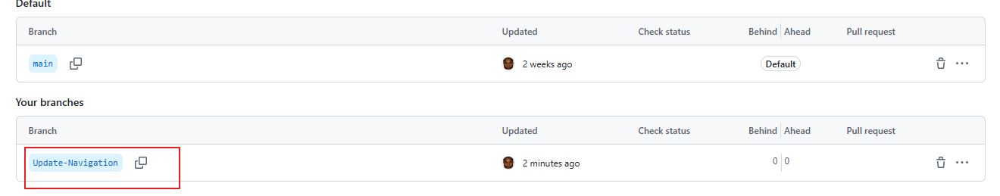
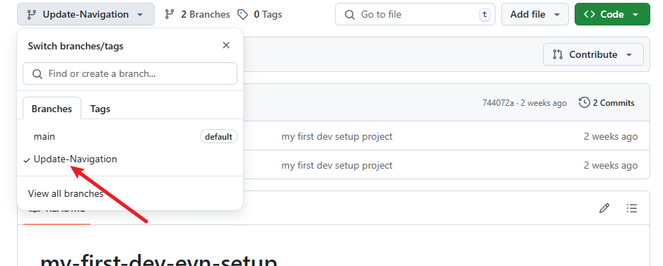
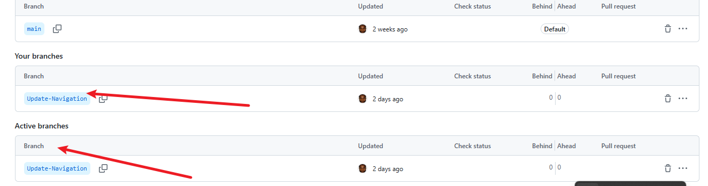

# Created Branches on Main

## In this project I will showing how Tom and Jerry created branches and named them update-navigation and add-contact-info

1. ### Jerry Branch

Jerry name his branch update-navigation

2. ### Branch Naming

Jerry name his just created branch update navigation

3. ### Branch Switch

Switching to the update navigation branch that was just created y Jerry to start working on it

