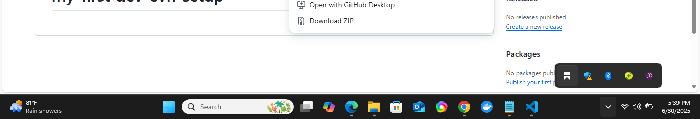
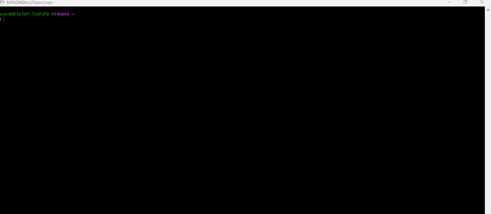
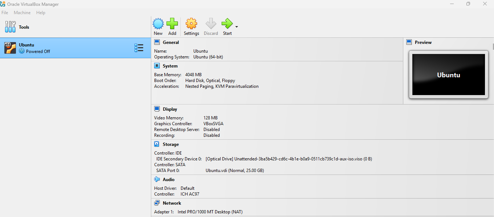
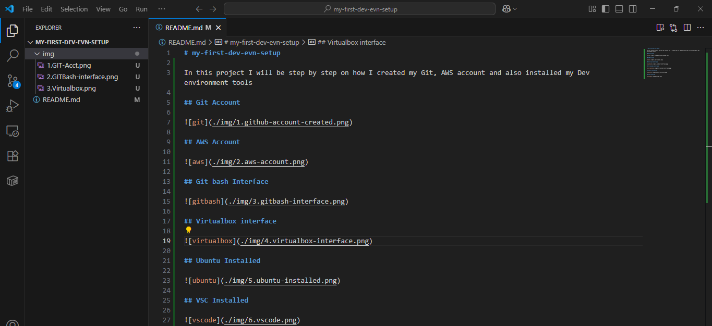
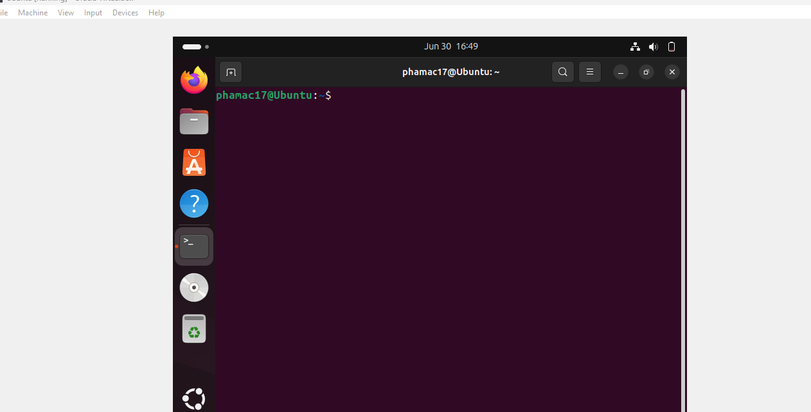
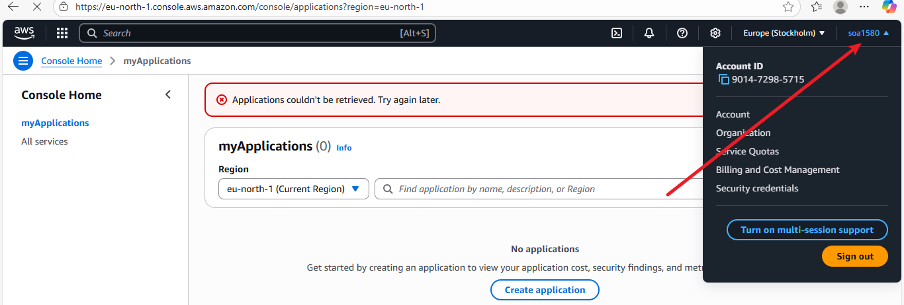

# my-first-dev-evn-setup

In this project I will be showing step by step on how I created my Git, AWS account and also installed my Dev environment tools

## Git Account 

## GITBash Account

## Virtualbox interface

## VSC Installed

## Ubuntu Installed

## AWS Interface

