# my-first-dev-evn-setup

In this project I will be showing step by step on how I created my Git, AWS account and also installed my Dev environment tools

## Git Account 

## GITBash Account

## Virtualbox interface

## VSC Installed

## Ubuntu Installed

## AWS Interface

<<<<<<< HEAD

# Created Branches on Main

## In this project I will showing how Tom and Jerry created branches and named them update-navigation and add-contact-info

1. ### Tom Branch

Tom name his branch update-navigation

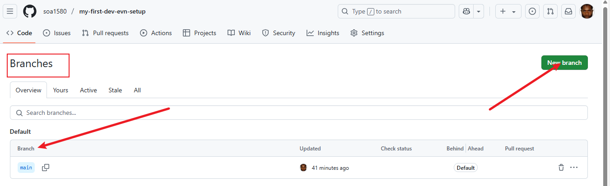

2. ### Branch Naming

Tom name his just created branch update navigation

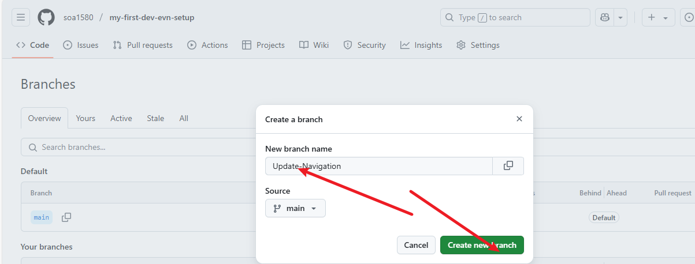

3. ### Branch Switch

Switching to the update navigation branch that was just created by Tom to start working on it

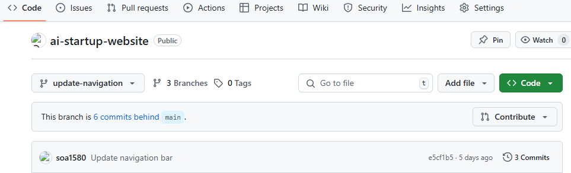

1. ### Jerry Branch

Tom name his branch update-navigation

2. ### Branch Naming

Jerry name his just created branch update navigation

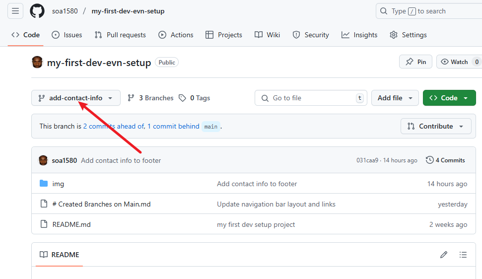

3. ### Branch Switch

Switching to the add-contact-info branch that was just created by Jerry to start working on it.

4. ### showing index code in terminal

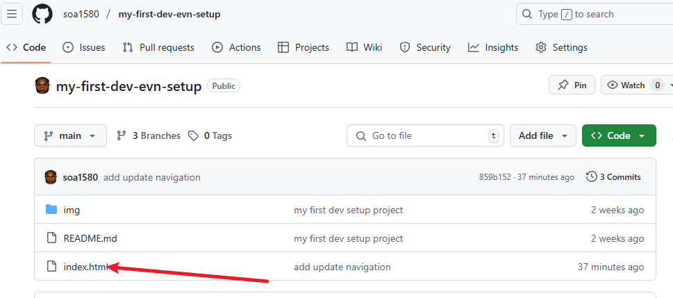

5. ### showing main code

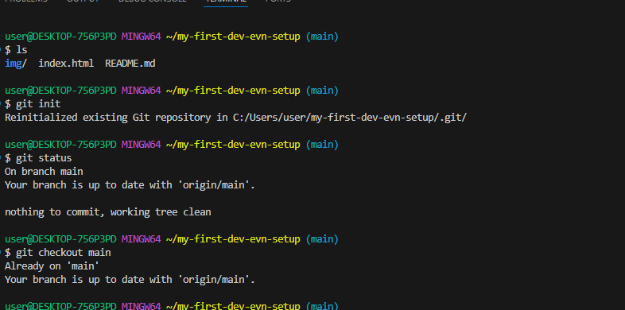

6. ### showing updnav code

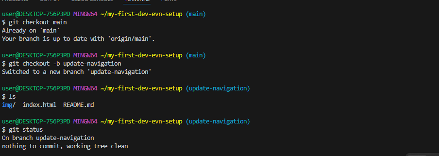

7. ### showing Add-contact-info code

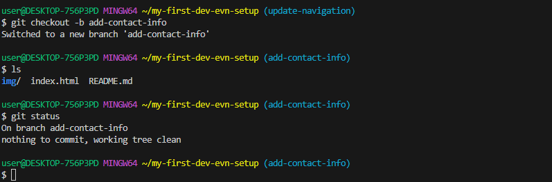

8. ### showing git add, commit m and push code

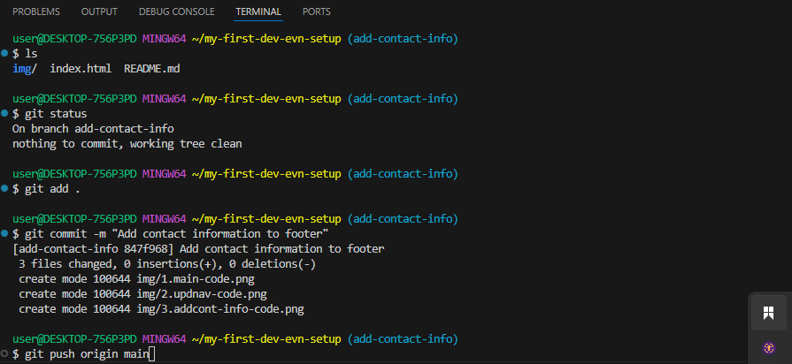

# The below will showing Pull Request Creation for the Tom and Jerry branches

1. ### Pull request Created for both Tom and Jerry

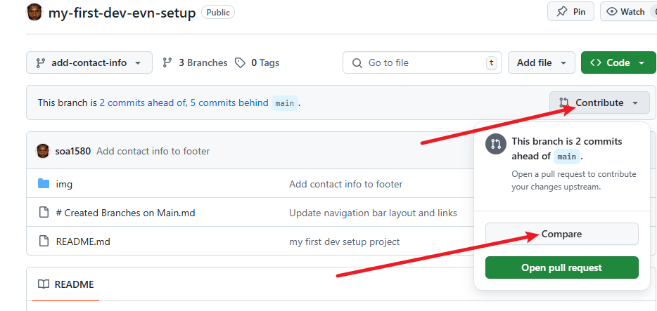

2. ### Given title and description for add contact info and update navigation

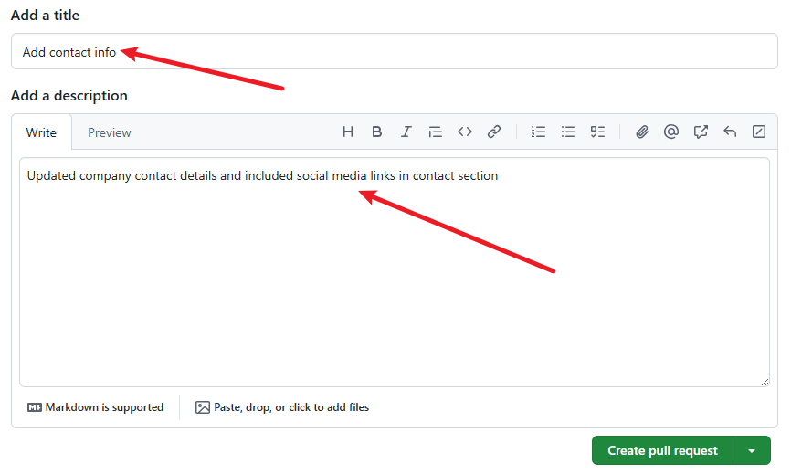

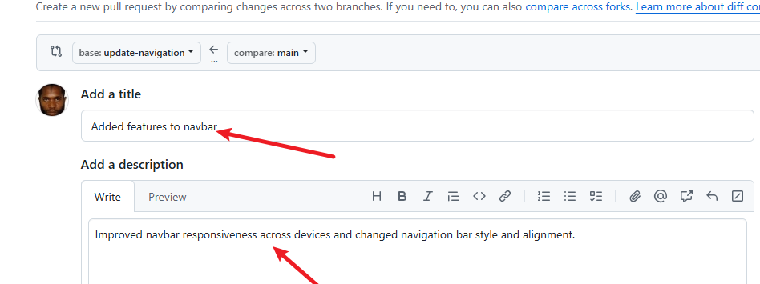

3. ### Compare the pull requst created before the merge